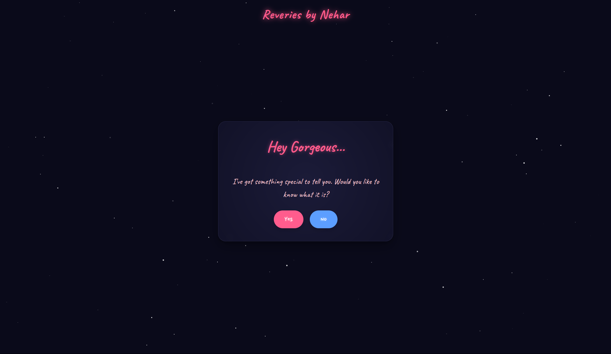
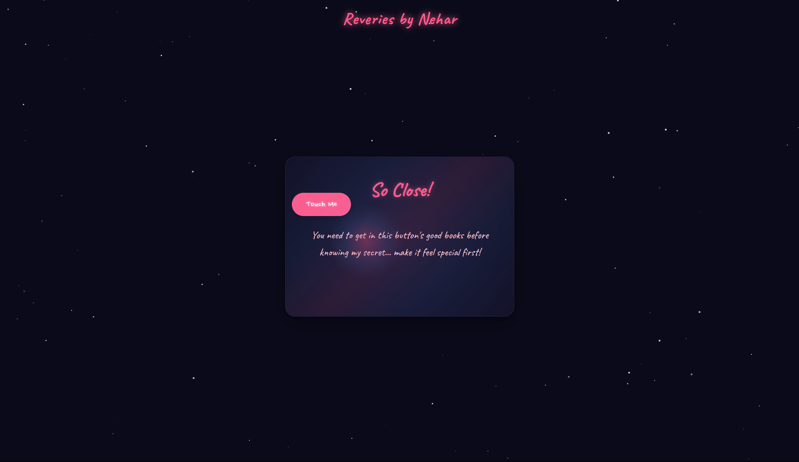

# Tickles


An interactive and playful web experience featuring a "hard-to-catch" button with humorous, flirtatious messages. Perfect for creating fun, interactive confession pages, date requests, proposals, or just to mess with friends.


## ✨ Features

- **Playful Interaction**: Button runs away from the cursor when hovered or clicked
- **Flirtatious Callouts**: Over 100 customizable, humorous messages appear when the button is clicked
- **Dreamy Aesthetic**: Beautiful starry background with soft animations
- **Progressive Challenge**: Button becomes increasingly difficult to catch
- **Rewarding Finale**: Special message or meme revealed after persistent attempts
- **Multiple Themes**: Several pre-configured versions for different use cases

## 🎮 Demo

Try the live demos:

- [View Demo](https://nehar-shinz.github.io/tickles)

## 🖼️ Screenshots

<div align="center">
  
  
</div>

## 💖 Use Cases

Tickles is perfect for creating interactive pages to:

- **Confess your love** to someone special
- **Ask someone out** on a date
- **Propose marriage** in a unique way
- **Share a joke** with friends
- **Create viral content** for social media

## 🚀 Getting Started

### Simple Installation

1. Clone the repository:
   ```bash
   git clone https://github.com/nehar-shinz/tickles.git
   ```

2. Open `tickles.html` in your browser or deploy to your web server.

### Customization

1. Open `tickes.html` in your favorite code editor
2. Modify the `loadingMessages` array to change the loading messages
3. Modify the `calloutMessages` array to change the button's responses
4. Edit the final message in the `finalMessageContainer` div
5. Change colors in the CSS `:root` variables

## 🎨 Customization Options

### Color Scheme

Edit the CSS variables in the `:root` selector:

```css
:root {
    --pink: #ff5c8d;
    --light-pink: #ffccd5;
    --blue: #5c9eff;
    --light-blue: #d0e2ff;
    --dark-text: #f1f1f1;
    --bg-dark: #0a0a1a;
    --card-bg: rgba(15, 15, 35, 0.8);
    --card-border: rgba(70, 70, 120, 0.4);
}
```

### Final Message

Change the final message by editing:

```html
<div id="finalMessageContainer" class="final-message">
    <h2>I Love You!</h2>
    
</div>
```

## 🔧 Advanced Options

### Difficulty Level

Adjust how difficult the button is to catch by modifying these parameters:

```javascript
// More evasive movement (higher = harder to catch)
const randomDuration = 0.1 + Math.random() * 0.2;

// Number of clicks required (higher = more persistence needed)
if (runCounter < 10) { // Change 10 to your desired number
```

### Button Behavior

Modify the button's movement patterns:

```javascript
// Change initial positioning
const safeMarginTop = textBottom + 30;

// Adjust random movement range
const newX = Math.floor(Math.random() * containerWidth);
const newY = Math.floor(Math.random() * containerHeight);
```

## 📱 Mobile Compatibility

Tickles is designed to work on both desktop and mobile devices. On touch devices, the button responds to taps instead of hover events.

## 🔗 Live Versions

| Version | Description | Link |
|---------|-------------|------|
| **Confession** | A sweet way to confess your love to someone special | [View Confession](https://nehar-shinz.github.io/tickles/confession.html) |
| **Date** | Ask someone out on a date with a playful twist | [View Date](https://nehar-shinz.github.io/tickles/date.html) |
| **Proposal** | A unique way to pop the question | [View Proposal](https://nehar-shinz.github.io/tickles/proposal.html) |
| **Habibi** | A luxurious invitation to visit Dubai | [View Habibi](https://nehar-shinz.github.io/tickles/habibi.html) |
| **EFFO** | A humorous meme version with a not-so-subtle message | [View EFFO](https://nehar-shinz.github.io/tickles/effo.html) |


## 🤝 Contributing

Contributions are welcome! Please feel free to submit a Pull Request.

## 📜 License

This project is licensed under the MIT License

## 💬 Acknowledgments

- Font "Caveat" and "Nanum Pen Script" by Google Fonts
- Inspired by playful web interactions from the early web era

---

<p align="center">Made with ❤️ and a sense of humor</p>